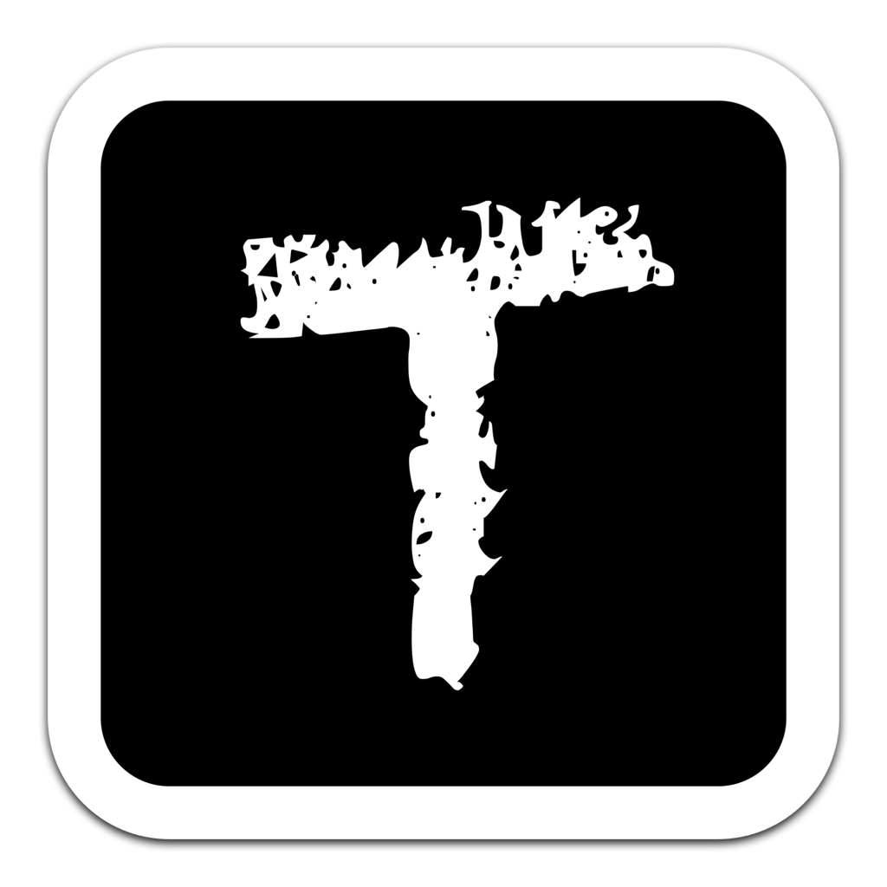

<div align="center">
  <p>
    
  </p>
  <h1><strong>Texz</strong></h1>
  <hr/>
  <p>一个跨平台的轻量级文本处理小工具，基于 Go 语言。</p>
</div>


<div align="center">


</div>


## 开发

* Development

```bash
wails dev
```

* Build

```bash
wails build
```

## 模块

### Decode (解码指定字符串)

* Base64 Decode : 对字符串进行 Base64 解码。
* Unicode Decode : 对 Unicode 字符串进行解码。
* URL Decode : 对字符串进行URL解码。

### Encode (编码指定字符串)

* Base64 Encode : 对字符串进行 Base64 解码。
* MD5 Crypto : 对字符串进行 MD5 加密。
* Unicode Encode : 对字符串进行 Unicode 编码。
* URL Encode : 对字符串进行 URL 编码。

### Extract (提取指定字符串)

* Extract Chinese : 提取所有中文字符。
* Extract Link : 提取所有链接。

### Remove (清除指定字符串)

* Remove Chinese : 移除所有中文字符。
* Remove Space : 移除所有空格。 `TODO`
* Remove Comment : 清除所有注释代码。 `TODO`

### Format (格式化指定字符串)

* Format JSON : 格式化 JSON 字符串。 `TODO`
* Format Space : 格式化中英文空格。 `TODO`
* Format GO : 格式化 GO 字符串。 `TODO`

### Convert (转换字符串格式)

* Markdown to HTML : Markdown 转 HTML。 `TODO`
* Cookie to JSON : 将 Cookie 字符串转为 JSON 格式。 `TODO`
* JSON to Cookie : 将 JSON 格式 Cookie 转为字符串。 `TODO`


## 演示


